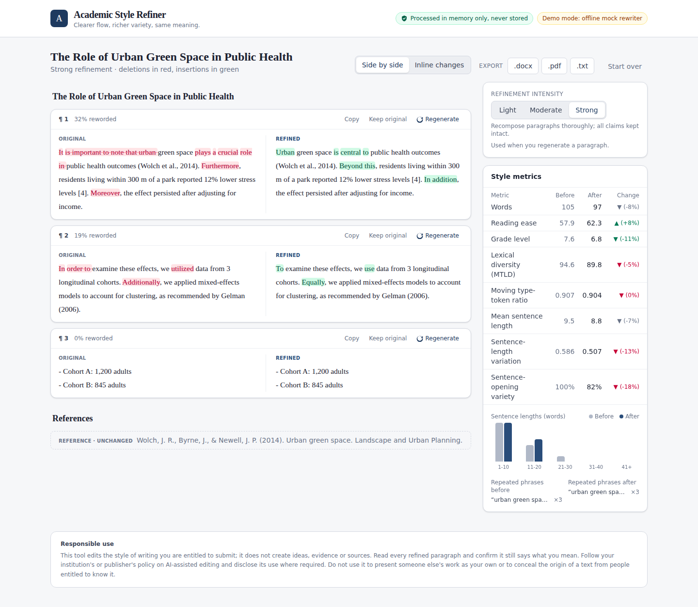

# Academic Style Refiner

A web application that improves the flow, lexical variety and sentence rhythm of long
academic and professional reports (up to 10,000 words), while keeping their meaning,
facts, citations, terminology and formal register intact.



## Features

- **Input:** paste text or upload `.txt` / `.docx` (drag and drop), with live word count and
  a readability preview.
- **Structure-aware chunking:** headings, lists and reference lists are detected;
  references and headings are never rewritten; long paragraphs are split at sentence
  boundaries.
- **Protected content:** citations, numeric references, URLs, DOIs, inline maths and direct
  quotations are masked before the model sees the text and restored afterwards.
- **Two-stage rewriting with Claude:** pass 1 paraphrases and restructures; pass 2 checks
  fidelity against the original and polishes coherence and rhythm. Each stage is validated
  in code (no lost citations or numbers) with automatic retry and safe fallback.
- **Intensity control:** Light, Moderate or Strong.
- **Review:** side-by-side or inline word-level diff, percentage reworded, per-paragraph
  **Regenerate**, **Keep original** and **Copy**.
- **Metrics:** Flesch Reading Ease, Flesch-Kincaid grade, MTLD, MATTR, sentence-length
  variation and histogram, sentence-opening variety, repeated phrases; before vs after.
- **Export:** `.docx`, `.pdf`, `.txt`.
- **Progress:** live per-paragraph status over Server-Sent Events.
- **Privacy-first:** in-memory processing only, no database or file storage, automatic
  purge, no document text in logs.

## Quick start

```bash
cp .env.example .env        # add ANTHROPIC_API_KEY (or set REFINER_MOCK_LLM=true)
docker compose up --build
# open http://localhost:8000
```

Local development without Docker, reverse-proxy setup, scaling and configuration are
covered in [docs/DEPLOYMENT.md](docs/DEPLOYMENT.md).

## Documentation

| Document | Contents |
|---|---|
| [docs/ARCHITECTURE.md](docs/ARCHITECTURE.md) | System design, request flow, metrics, privacy model, module map |
| [docs/PROMPTS.md](docs/PROMPTS.md) | The exact system prompts and templates for each rewriting stage |
| [docs/DEPLOYMENT.md](docs/DEPLOYMENT.md) | Docker, local dev, reverse proxy, access control, scaling, configuration |
| [docs/RESPONSIBLE_USE.md](docs/RESPONSIBLE_USE.md) | Guidance on ethical academic use |

## Project layout

```
academic-style-refiner/
├── backend/            FastAPI app (Python 3.11+)
│   ├── app/            routes, chunking, protection, prompts, rewriter, metrics, exports
│   └── tests/          pytest suite (runs offline against the mock rewriter)
├── frontend/           React 19 + TypeScript + Tailwind CSS 4 (Vite)
├── docs/
├── Dockerfile          multi-stage build: frontend + API in one image
└── docker-compose.yml
```

## Tech stack

FastAPI · Anthropic Python SDK (Claude Opus 5.5, adaptive thinking) · python-docx ·
ReportLab · React · TypeScript · Tailwind CSS · Vite · `diff`.

## Responsible use

This is an editing tool for writing you are entitled to submit. Follow your institution's
policy on AI-assisted editing, disclose its use where required, and review every change.
See [docs/RESPONSIBLE_USE.md](docs/RESPONSIBLE_USE.md).
