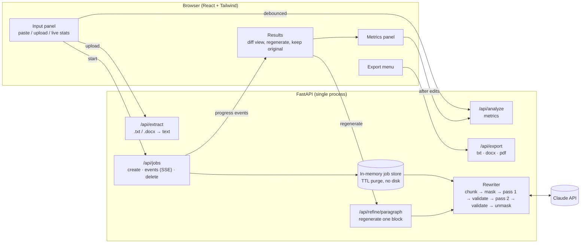

# Architecture

## Overview

## Request flow for a full document

1. **Input.** The user pastes text or uploads a `.txt`/`.docx` file. `/api/extract` converts
   Word headings to `#` markers and groups list items, so structure survives. While typing,
   the UI shows a word count and calls `/api/analyze` (debounced) for a readability preview.
2. **Job creation.** `POST /api/jobs` checks the 10,000-word limit and the server's
   concurrent-job cap, splits the document into blocks and starts a background task.
   It returns the block list immediately, so the UI can render placeholders.
3. **Chunking** (`chunker.py`).
   - Blocks are separated by blank lines (or by single newlines when a text has no blank
     lines). Hard-wrapped lines inside a paragraph are re-flowed.
   - Each block is classified as `heading`, `paragraph`, `list` or `reference`. Everything
     after a "References" / "Bibliography" / "Works cited" heading is a reference and is
     never rewritten. Headings are never rewritten either.
   - Paragraphs over 320 words are split into evenly sized, sentence-aligned segments.
     Each segment is rewritten with the already-rewritten previous segment as context, then
     the segments are joined back together.
4. **Protection** (`protect.py`). Before anything goes to the model, citations
   (`(Smith et al., 2020)`, `[3–5]`), URLs, DOIs, inline maths and direct quotations are
   replaced with tokens `⟦P1⟧, ⟦P2⟧, …`. The model never sees the protected text, so it
   cannot alter it.
5. **Two-stage rewrite** (`rewriter.py`, prompts in [PROMPTS.md](PROMPTS.md)).
   - Pass 1: deep paraphrase and structural variation at the chosen intensity, with the
     neighbouring paragraphs as read-only context.
   - Validation: every token present exactly once, no invented tokens, every number in the
     source still present. One retry with the specific problem described; if that also
     fails, the original paragraph is kept and a warning is attached.
   - Pass 2: fidelity check against the original, then coherence, transitions and rhythm.
     Same validation; on failure the validated pass-1 draft is used.
   - Tokens are swapped back for the original spans.
6. **Concurrency.** Paragraphs run in parallel (default 4 at a time per job). Context comes
   from the *original* neighbours so paragraphs don't wait on each other.
7. **Progress.** The job emits `progress`, `stage` (`rewrite`/`polish`), `block`,
   `block_error` and `done` events, streamed to the browser over Server-Sent Events.
   The `done` event carries before/after metrics for the whole document.
8. **Review.** The UI shows each paragraph side by side (or inline) with a word-level diff,
   the share of words changed, warnings, and buttons to **Regenerate**, **Keep original**
   or **Copy**. Regenerate calls `/api/refine/paragraph` with the current intensity, the
   (refined) previous paragraph and the next paragraph as context, and the current version
   as something to differ from. Metrics are recomputed after any change.
9. **Export.** The browser sends the final blocks to `/api/export`, which returns a `.txt`,
   `.docx` (python-docx) or `.pdf` (ReportLab, DejaVu Serif for Unicode coverage).
10. **Clean-up.** As soon as the job finishes the browser deletes it on the server. Anything
    left behind (closed tabs, lost connections) is purged after 30 minutes.

## Metrics (`metrics.py`)

| Metric | Meaning |
|---|---|
| Flesch Reading Ease / Flesch-Kincaid grade | Classic readability formulas (syllables estimated heuristically). |
| MTLD | Measure of Textual Lexical Diversity (McCarthy & Jarvis, 2010), bidirectional; robust to text length. |
| MATTR | Moving-average type-token ratio over 50-word windows. |
| Type-token ratio | Distinct words / total words (length-sensitive; shown for reference). |
| Mean sentence length, SD, variation | Variation = SD / mean, i.e. how much sentence lengths vary. |
| Sentence-length histogram | Counts of sentences per length band, before vs after. |
| Opening variety | Share of sentences whose first word is not shared with another sentence. |
| Repeated phrases | Content-bearing three-word sequences that occur 3+ times. |

## Privacy model

- No database and no file writes. Uploaded files are read into memory, converted to text and
  discarded. Job state lives in a Python dict and is deleted when the browser finishes or
  after `REFINER_JOB_TTL_SECONDS` (default 30 minutes).
- Logs never contain document text: only job IDs, error types and API request IDs.
- API responses carry `Cache-Control: no-store`.
- Text is sent to the Claude API for rewriting, so Anthropic's commercial terms and data
  retention policy apply to it. Check them against your institution's requirements before
  processing confidential or unpublished work.

## Backend modules

| File | Responsibility |
|---|---|
| `app/main.py` | FastAPI routes, SSE stream, static frontend hosting |
| `app/config.py` | Settings from `REFINER_*` environment variables |
| `app/chunker.py` | Block splitting/classification and long-paragraph segmentation |
| `app/protect.py` | Masking protected spans and fidelity validation |
| `app/prompts.py` | System prompts, intensity directives, message templates |
| `app/rewriter.py` | Two-stage pipeline with retries and fallbacks |
| `app/llm.py` | Claude API client (adaptive thinking, effort, fallbacks, error mapping) and offline mock |
| `app/jobs.py` | In-memory job store, parallel processing, event log, TTL purge |
| `app/metrics.py` | Readability and style metrics |
| `app/documents.py` | `.txt`/`.docx` import and `.txt`/`.docx`/`.pdf` export |
| `app/textutils.py` | Sentence splitting and word tokenisation |

## Frontend modules

| File | Responsibility |
|---|---|
| `src/App.tsx` | State machine (input → processing → results), job events, regenerate, export |
| `src/components/InputPanel.tsx` | Paste/upload/drag-and-drop, live word count and readability preview |
| `src/components/IntensityControl.tsx` | Light / Moderate / Strong selector |
| `src/components/ProgressPanel.tsx` | Progress bar with live stage counts and cancel |
| `src/components/ParagraphCard.tsx` | Side-by-side or inline diff, regenerate / keep original / copy |
| `src/components/MetricsPanel.tsx` | Before/after table, sentence-length histogram, repeated phrases |
| `src/components/ExportMenu.tsx` | `.docx` / `.pdf` / `.txt` downloads |
| `src/lib/api.ts` | Typed API client and SSE subscription |
| `src/lib/diff.ts` | Word-level diff and change ratio |
